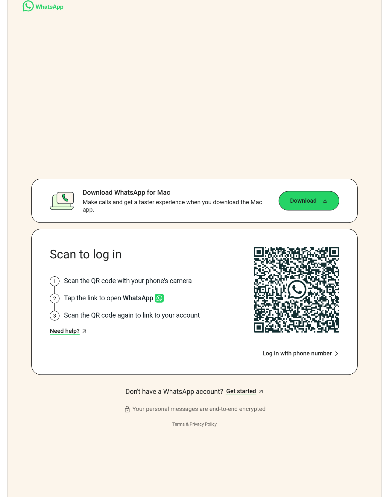

# Walz

A native WhatsApp desktop client for Linux, built with Tauri 2.0. Walz wraps
WhatsApp Web and adds the system integration WhatsApp Web doesn't have on its
own: a tray icon with an unread badge, native desktop notifications, MPRIS
media controls for voice messages, Do Not Disturb, and multiple isolated
profiles.



## Features

Walz adds a system tray icon with an unread count badge, plus native desktop notifications that jump straight to the right chat when clicked. Do Not Disturb suppresses both notifications and download alerts, and the setting persists across restarts. Voice messages can be controlled from your system's media controls (play, pause, seek) through MPRIS.

You can run multiple isolated profiles, for example `walz --profile work` alongside your default session, each with its own data directory. The window follows your desktop's dark or light theme automatically, and you can drop a stylesheet into `~/.config/walz/custom.css` for further customization.

Images and files copied from a file manager can be pasted or dragged straight into a chat. Keyboard shortcuts cover the basics: `Ctrl+F` for search, `Ctrl+N` for a new chat, `Ctrl+±0` for zoom, and `Esc` to close panels.

## Installation

### Quick install (prebuilt binary)

```sh
curl -fsSL https://raw.githubusercontent.com/alex-oleshkevich/walz/master/install.sh | bash
```

This downloads the latest release for your platform and installs it to
`~/.local/bin`, no `sudo` required. It currently covers Linux x86_64 only;
other platforms should build from source (see below).

### Arch Linux

A `PKGBUILD` is included in this repository:

```sh
git clone https://github.com/alex-oleshkevich/walz.git
cd walz
makepkg -si
```

It isn't published on the AUR yet, so you build it locally from the
`PKGBUILD` above.

### Build from source

Requires Rust, Node.js, and the Tauri Linux dependencies (`webkit2gtk-4.1`,
`libayatana-appindicator`, `librsvg2`, `patchelf`):

```sh
git clone https://github.com/alex-oleshkevich/walz.git
cd walz
npm install
npm run tauri build
```

## Usage

```sh
walz                    # default profile
walz --profile work     # separate, isolated session
walz --list-profiles    # list existing profiles
walz --minimized         # start minimized to the tray
```

Data lives in `~/.local/share/walz/` and config in `~/.config/walz/` (or
`~/.local/share/walz/profiles/<name>/` and `~/.config/walz/profiles/<name>/`
for named profiles).

## License

MIT
